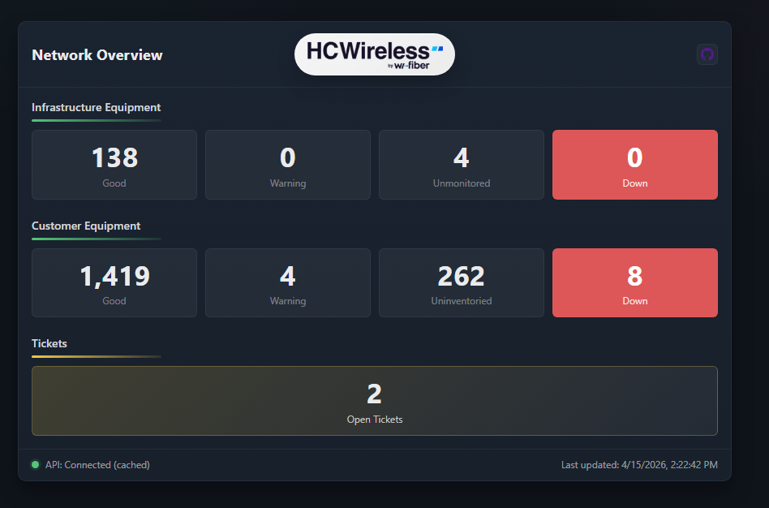
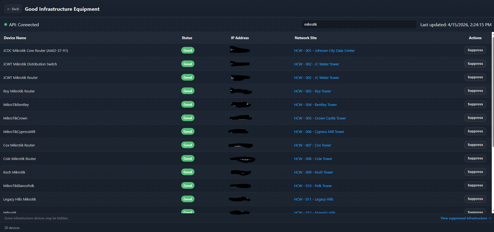

# Sonar Network Dashboard

This is an internal network status dashboard for ISP/WISP operations that use Sonar for customer and network management, built on **Node.js + Express** with a vanilla JS frontend.  
It pulls data from **Sonar’s GraphQL API**, caches it server-side, and presents it in a user friendly format.


## What it does currently

- Displays infrastructure and customer device statuses (Good / Warning / Down / Uninventoried)
- Provides customer and infrastructure equipment ICMP status views and total counts
- Includes detail pages for customer Good / Warning / Down / Uninventoried and suppressed views
- Includes paginated Good customer browsing plus customer and infrastructure suppression workflows
- Uses lightweight loading polish on navigation and refreshes, including panel fade-in, skeleton rows, and footer/progress states
- Automatically proxies and caches Sonar GraphQL requests
- Designed for LAN use only

## Setup
Clone the repository into a folder via Bash terminal
```bash
git clone https://github.com/AshfordMonte/sonar-network-dashboard.git .
```

Open the .env.example file and fill in the necessary data from your Sonar instance.

```bash
# Server
PORT=3000      # This can be any free port on the device
CACHE_TTL_MS=60000 # Cache duration for Sonar API responses (milliseconds)
# Sonar GraphQL
SONAR_ENDPOINT=https://example.sonar.software/api/graphql   # Replace with Sonar instance domain
SONAR_TOKEN=replace_me    # Replace with Personal Access Token generated in your User Profile

SONAR_COMPANY_ID=0      # Located at Settings > Company > Companies
SONAR_ACCOUNT_STATUS_ID=0 # ID for customer Account Status listed as "Active - Company Name"
```
This dashboard assumes you already have a working Sonar poller in your network, and it is set to monitor the respective subnets in use.

Ensure that the network site and customer inventory item models are included in a Network Monitoring Template. These can be found in Settings > Monitoring > Network Monitoring Templates.

Run the following commands in bash to install necessary packages, remove example file names, and start the web server.
```bash
npm install
cp .env.example .env
cp ./data/suppressions.example.json ./data/suppressions.json && cp ./data/infrastructure-suppressions.example.json ./data/infrastructure-suppressions.json
npm start
```
The server binds to all host IPv4 addresses by default for LAN access.

## Tech Stack

- **Backend:** Node.js, Express
- **Frontend:** Vanilla HTML, CSS, JavaScript  
- **Data:** Sonar GraphQL API
- **Testing:** Playwright browser tests with mocked dashboard API responses

## Local Commands

- Install dependencies: `npm install`
- Start app: `npm start`
- Run end-to-end tests: `npm run test:e2e`
- Run end-to-end tests headed: `npm run test:e2e:headed`
- Open the last Playwright report: `npm run test:e2e:report`

## Playwright Testing

The Playwright suite starts the local Express server and mocks browser-side `/api/*` requests so UI tests can run without live Sonar access.

- Install the browser runtime once on a new machine with `npx playwright install chromium`
- Run `npm run test:e2e` to execute the dashboard smoke and interaction suite
- Use `npm run test:e2e:headed` when you want to watch the browser while tests run
- Use `npm run test:e2e:report` after a run to inspect the HTML report

Because the tests intercept API calls in the browser, they do not require real Sonar credentials to validate page rendering, filtering, pagination, and suppression flows.

## Project Structure

```text
sonar-network-dashboard/
|-- data/
|   |-- infrastructure-suppressions.example.json  # Example infrastructure suppression store
|   |-- infrastructure-suppressions.json          # Live infrastructure suppression store
|   |-- suppressions.example.json                 # Example customer suppression store
|   `-- suppressions.json                         # Live customer suppression store
|
|-- public/                         # Frontend (served statically)
|   |-- index.html                  # Main dashboard
|   |-- app.js                      # Dashboard client logic
|   |-- loading-ui.js               # Shared loading animations and skeleton helpers
|   |-- styles.css                  # Global UI styles
|   |-- refresh-config.js           # Client refresh interval config
|   |-- hc-wireless-logo.avif       # Dashboard header branding
|   |
|   |-- good.html                   # Good customers page
|   |-- good.js                     # Good customers table logic with pagination
|   |-- down.html                   # Down customers page
|   |-- down.js                     # Down customers table logic
|   |-- uninventoried.html          # Uninventoried customers page
|   |-- uninventoried.js            # Uninventoried customers table logic
|   |-- warning.html                # Warning customers page
|   |-- warning.js                  # Warning customers table logic
|   |-- suppressed.html             # Suppressed customers page
|   `-- suppressed.js               # Suppressed customers logic
|   |
|   |-- infrastructure-good.html       # Good infrastructure page
|   |-- infrastructure-good.js         # Good infrastructure table logic
|   |-- infrastructure-warning.html    # Warning infrastructure page
|   |-- infrastructure-warning.js      # Warning infrastructure table logic
|   |-- infrastructure-down.html       # Down infrastructure page
|   |-- infrastructure-down.js         # Down infrastructure table logic
|   |-- infrastructure-unmonitored.html # Unmonitored infrastructure page
|   |-- infrastructure-unmonitored.js   # Unmonitored infrastructure table logic
|   |-- infrastructure-suppressed.html  # Suppressed infrastructure page
|   `-- infrastructure-suppressed.js    # Suppressed infrastructure logic
|
|-- src/                            # Server-side logic
|   |-- routes/
|   |   |-- api.js                  # Summary and table API endpoints
|   |   `-- suppressions.js         # Suppression CRUD endpoints
|   |
|   |-- services/
|   |   |-- sonarService.js         # Sonar data access + row shaping
|   |   `-- suppressionStore.js     # JSON-backed suppression persistence
|   |
|   |-- sonar/
|   |   |-- inventoryQueryBuilder.js   # Shared GraphQL query builder helpers
|   |   `-- queries.js              # Centralized Sonar GraphQL queries
|   |
|   `-- utils/
|       |-- env.js                  # Environment variable validation
|       |-- network.js              # Detects host LAN IP addresses
|       `-- normalize.js            # Shared normalization helpers
|
|-- .env                            # Local environment configuration
|-- .env.example                    # Example environment file
|-- .gitignore
|-- package.json
|-- package-lock.json
|-- playwright.config.js            # Playwright test runner configuration
|-- server.js                       # Express application entry point
|-- sonarClient.js                  # Sonar GraphQL client wrapper
|-- tests/                          # Browser tests and Playwright helpers
`-- README.md
```



